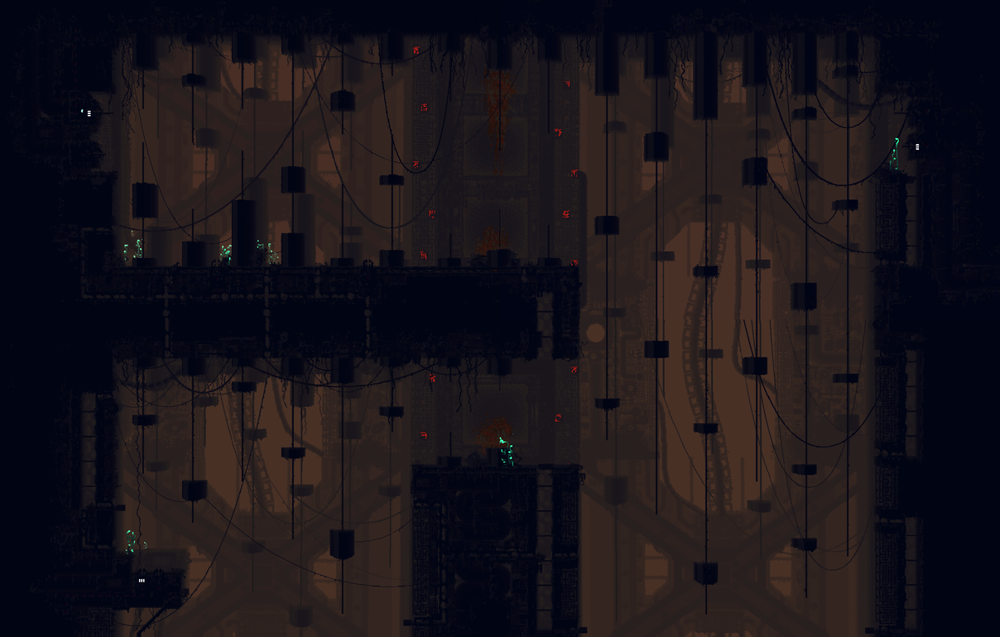

# Screenshoot

A [Rain World](https://store.steampowered.com/app/312520/Rain_World/) mod that stitches
**every camera in the current room into one seamless full-room screenshot** — with the
camera overlaps handled correctly, so there's no doubling or ghosting at the seams.

Rain World rooms are made of several overlapping camera views. Naive screenshot stitchers
paste each camera's whole frame on top of the next, so anything in an overlap gets drawn
twice (doubled/ghosted). Screenshoot instead assigns **every output pixel to exactly one
camera**, with nothing duplicated. Within each overlap it routes the camera-to-camera seam
along a **minimum-error path** — the cut follows pixels where the two cameras agree (sky,
flat ground) and detours around foreground objects where they don't — so the seam lands
where it's least visible instead of slicing straight through a plant.



*A whole room (UW_D04) captured in one image — stitched from its four overlapping cameras.*

## Usage

In-game, while in a room:

- **F9** — clean shot: just the room geometry (creatures, player and HUD hidden).
- **F10** — live shot: the full scene (creatures, player, weather), HUD hidden.

PNGs are saved to `Pictures\screenshots\` by default.

The hotkeys, output folder, capture quality (settle frames), and a debug per-frame dump are
all configurable in the **Remix** mod options menu.

## Install

**Steam Workshop:** subscribe (search "Screenshoot"), or publish/upload via the in-game
Remix menu.

**Manual:** download [`screenshoot.zip`](screenshoot.zip), and extract its contents into

```
Rain World/RainWorld_Data/StreamingAssets/mods/screenshoot/
```

so that `modinfo.json` sits directly in that folder. Then enable **Screenshoot** in the
Remix menu. Requires BepInEx (bundled with Rain World's Downpour/Remix).

## Build from source

Requires the .NET SDK and a Rain World install at
`C:\Program Files (x86)\Steam\steamapps\common\Rain World` (edit `Screenshoot.csproj` if
yours differs).

```
dotnet build
```

The build copies the DLL, `modinfo.json`, and `thumbnail.png` straight into the mod folder.

## How it works

Per camera position in the room, the mod drives the game's camera there, lets it render,
and reads back the frame; it then composites all frames in world space. Each pixel starts
assigned to its nearest covering camera, then every overlap boundary is rerouted along a
minimum-error seam (a dynamic program over how much the two cameras disagree). It reads the
rendered output (not the raw level texture, which is palette-encoded) so palettes, depth
shading and lighting come out right.

A note on parallax: Rain World bakes per-camera depth displacement into the room art, so a
deep object genuinely sits at slightly different positions in two overlapping cameras. The
seam routing hides this by cutting where the cameras match, but it can't change the art —
in a perfectly uniform region (e.g. a flat-lit wall) a faint tonal hairline along the seam
can remain. That's inherent to the baked art, not a bug.

See [`CLAUDE.md`](CLAUDE.md) for the full architecture and internals.

## Status

Working: both the live full-room screenshot (F10) and the clean geometry-only shot (F9).

## License

[MIT](LICENSE) © 2026 tr0z. Mod ID `tr0z.screenshoot`. Targets Rain World v1.9.x.

This license covers the mod's own source. It does not cover Rain World's assets or
assemblies; the decompiled game references used during development are gitignored and not
part of this repository.
